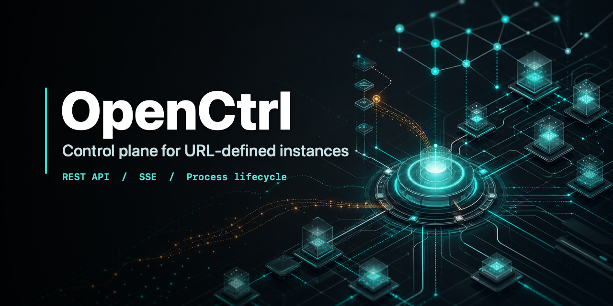
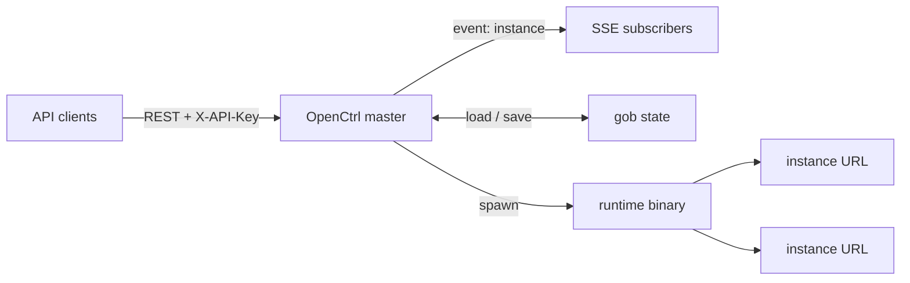

<p align="center">
  
</p>

<p align="center">
  <a href="docs/master.md"></a>
  <a href="docs/master.md"></a>
  
  <a href="LICENSE"></a>
</p>

OpenCtrl is a focused control-plane master for supervising URL-defined
instances. It stores instance definitions, launches a compatible runtime binary
for each managed instance, exposes a versioned REST API, and streams live
lifecycle, log, and metric updates over Server-Sent Events.

It is intentionally narrow: the master owns orchestration, persistence,
authentication, and observability; runtime binaries own protocol-specific work.

## Contents

- [Highlights](#highlights)
- [Architecture](#architecture)
- [Quick Start](#quick-start)
- [Master URL](#master-url)
- [API Surface](#api-surface)
- [Runtime Contract](#runtime-contract)
- [State and Security](#state-and-security)
- [Release](#release)
- [Documentation](#documentation)

## Highlights

| Capability | What it provides |
| --- | --- |
| URL-defined instances | Every managed workload is represented by one URL and one generated instance ID. |
| Process supervision | The master starts, stops, restarts, and deletes child processes through a stable runtime contract. |
| Versioned control API | REST endpoints are served under `/api/v2` or a custom versioned prefix. |
| Live event stream | SSE publishes initial state, lifecycle changes, child logs, metric checkpoints, deletions, and shutdown events. |
| Durable local state | Instance definitions and the API key are persisted beside the executable with a backup file. |
| Runtime neutrality | The master does not special-case child protocols; compatible binaries validate and execute their own URLs. |
| TLS-ready operation | HTTP, self-signed TLS, and file-backed TLS certificate modes are selected from the master URL. |

## Architecture



The master process provides the control plane. Child processes stay in the
foreground, emit logs and optional checkpoints, and exit when the master stops
them.

## Quick Start

Build the master:

```sh
go build -trimpath -o ./bin/openctrl ./cmd/openctrl
```

Start a local control plane:

```sh
./bin/openctrl 'master://127.0.0.1:8080'
```

The master prints an API key on startup:

```text
Master.run: API key created: <api-key>
```

Use the key with the versioned API:

```sh
BASE='http://127.0.0.1:8080/api/v2'
API_KEY='<api-key>'

curl -H "X-API-Key: ${API_KEY}" "${BASE}/info"
curl -H "X-API-Key: ${API_KEY}" "${BASE}/instances"
```

Run managed instances through a compatible runtime binary:

```sh
./bin/openctrl 'master://127.0.0.1:8080?bin=/opt/openctrl/runtime'
```

Create an instance:

```sh
curl -X POST "${BASE}/instances" \
  -H "X-API-Key: ${API_KEY}" \
  -H "Content-Type: application/json" \
  -d '{"alias":"edge-a","url":"managed://edge-a"}'
```

## Master URL

```text
master://<host>:<port>[/prefix][?<query>]
```

The host and port become the listen address. The optional path becomes the API
prefix, and the API version is appended automatically.

| Master URL | API base |
| --- | --- |
| `master://127.0.0.1:8080` | `http://127.0.0.1:8080/api/v2` |
| `master://127.0.0.1:8080/control` | `http://127.0.0.1:8080/control/v2` |
| `master://127.0.0.1:8443?tls=1` | `https://127.0.0.1:8443/api/v2` |

| Parameter | Values | Default | Purpose |
| --- | --- | --- | --- |
| `tls` | `0`, `1`, `2` | `0` | Select HTTP, self-signed TLS, or certificate-backed TLS. |
| `crt` | file path | empty | Certificate file used with `tls=2`. |
| `key` | file path | empty | Private key file used with `tls=2`. |
| `bin` | file path | current executable | Runtime binary used to launch managed instances. |

## API Surface

All protected requests must include:

```text
X-API-Key: <api-key>
```

Core endpoints:

| Method | Path | Description |
| --- | --- | --- |
| `GET` | `/info` | Return master identity, runtime configuration, uptime, and system metrics. |
| `POST` | `/info` | Set the master alias. |
| `GET` | `/instances` | Return all instances, including the internal API-key instance. |
| `POST` | `/instances` | Create and asynchronously start an instance. |
| `GET` | `/instances/{id}` | Return one instance. |
| `PATCH` | `/instances/{id}` | Update metadata, restart policy, or lifecycle action. |
| `PUT` | `/instances/{id}` | Replace the instance URL and restart the instance. |
| `DELETE` | `/instances/{id}` | Stop and delete the instance. |
| `GET` | `/events` | Open the Server-Sent Events stream. |
| `GET` | `/tcping?target=host:port` | Test TCP reachability from the master process. |

Lifecycle actions accepted by `PATCH /instances/{id}`:

| Action | Effect |
| --- | --- |
| `start` | Start a stopped child process. |
| `stop` | Stop an active child process. |
| `restart` | Stop and start the child process. |
| `reset` | Reset runtime byte counters. |

SSE frames use the event name `instance`:

```text
event: instance
data: {"type":"update","time":"2026-06-08T12:00:00Z","instance":{...},"logs":""}
```

Event payload types are `initial`, `create`, `update`, `delete`, `log`, and
`shutdown`.

## Runtime Contract

OpenCtrl supervises runtime binaries with a small process contract:

```text
<runtime-binary> <instance-url>
```

For non-`master` instance schemes, point `bin` at a binary that understands
those schemes. The master treats child URLs as opaque runtime configuration.

Runtime binaries MUST:

- accept the full instance URL as the first positional argument;
- reject invalid configuration before starting long-running work;
- stay in the foreground while the instance is active;
- handle termination and exit within the master's 5-second grace period when
  possible;
- return a non-zero exit code for failures that should place the instance in
  `error`;
- avoid printing secrets from URLs, headers, keys, or tokens.

Runtime binaries SHOULD:

- emit newline-delimited logs to stdout or stderr;
- emit checkpoints after the service is ready when metrics are available;
- keep byte counters monotonic for the life of the process.

Runtime binaries MAY:

- define their own URL schemes and query parameters;
- omit checkpoints when metrics are not meaningful;
- print ordinary operational logs that should be visible to API clients.

Checkpoint format:

```text
CHECK_POINT|MODE=<n>|PING=<n>ms|POOL=<n>|TCPS=<n>|UDPS=<n>|TCPRX=<bytes>|TCPTX=<bytes>|UDPRX=<bytes>|UDPTX=<bytes>
```

Non-checkpoint child output is forwarded to stdout and published as `log`
events. If a line contains the substring `ERROR`, the instance is marked
`error`.

## State and Security

State is stored beside the executable:

```text
<executable-directory>/gob/openctrl.gob
<executable-directory>/gob/openctrl.gob.backup
```

Operational notes:

- protect the API key printed by the master;
- protect the state directory because `openctrl.gob` stores the API key;
- use `tls=2` with a trusted certificate outside local-only deployments;
- use a trusted `bin` path because managed instances execute that binary;
- treat instance URLs as secrets when they contain credentials or tokens;
- account for permissive CORS headers when exposing the API across origins.

## Release

Build a local binary:

```sh
go build -trimpath -o ./bin/openctrl ./cmd/openctrl
```

Embed a version string:

```sh
go build -trimpath \
  -ldflags="-s -w -X main.version=$VERSION" \
  -o ./bin/openctrl ./cmd/openctrl
```

Tagged releases are built by GoReleaser for Darwin, FreeBSD, Linux, and
Windows on `amd64` and `arm64`.

## Documentation

- [Master API and runtime contract](docs/master.md)

## License

OpenCtrl is released under the BSD 3-Clause License.
